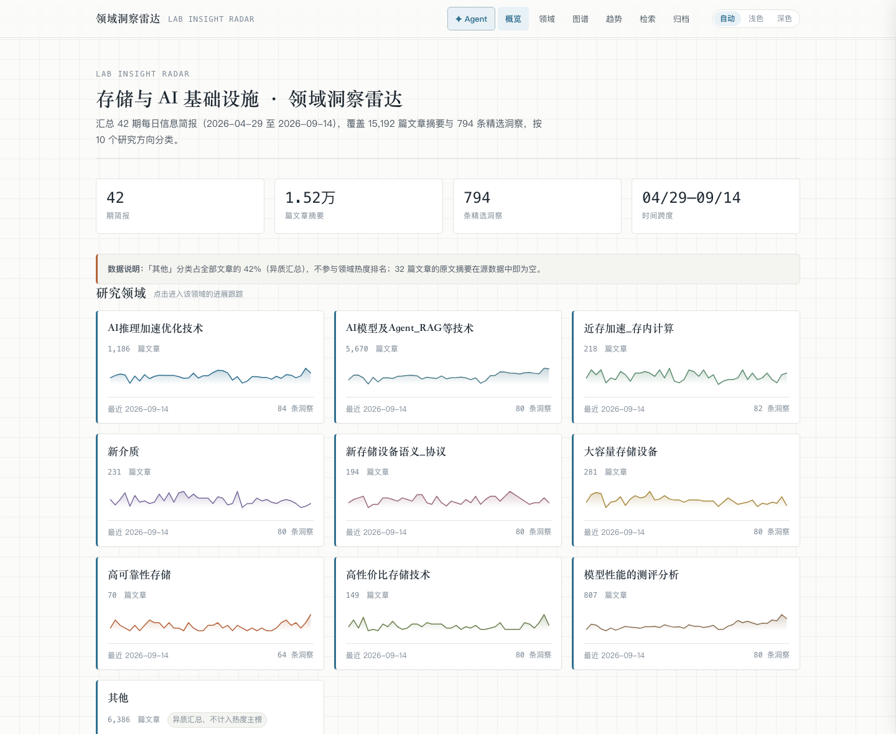
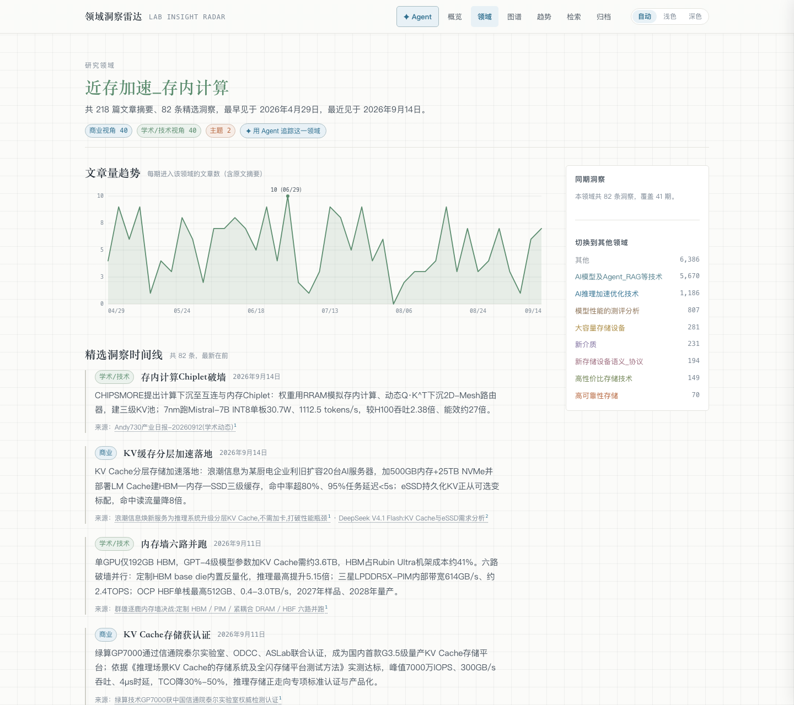
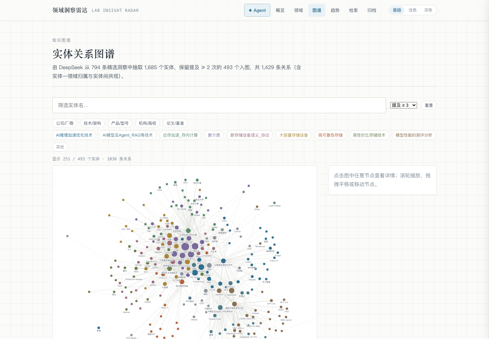
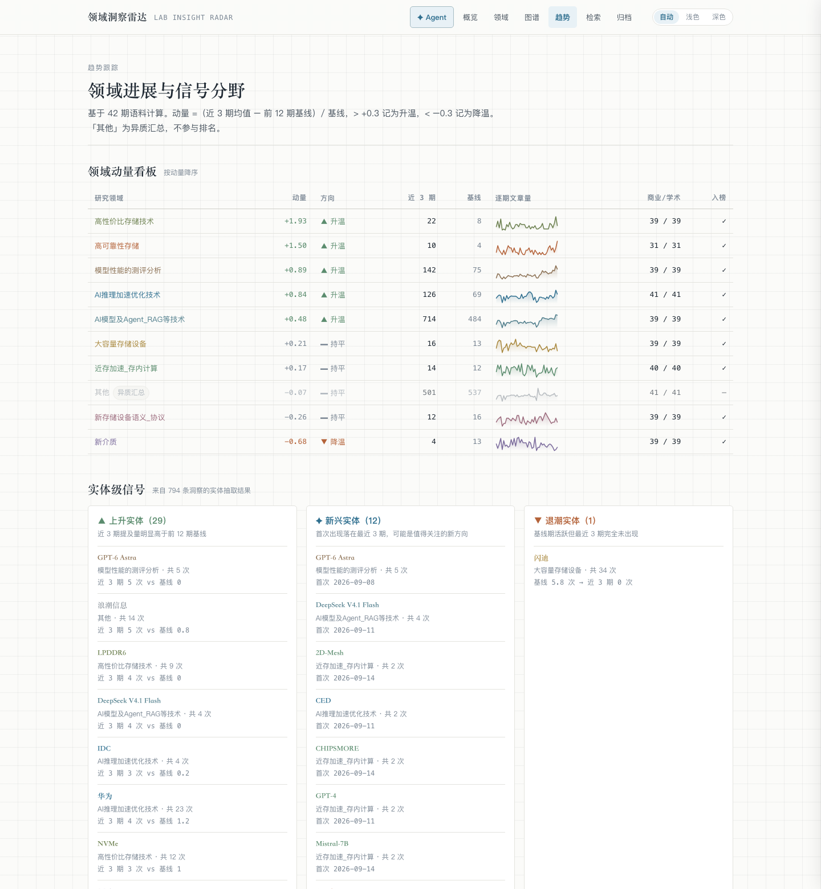
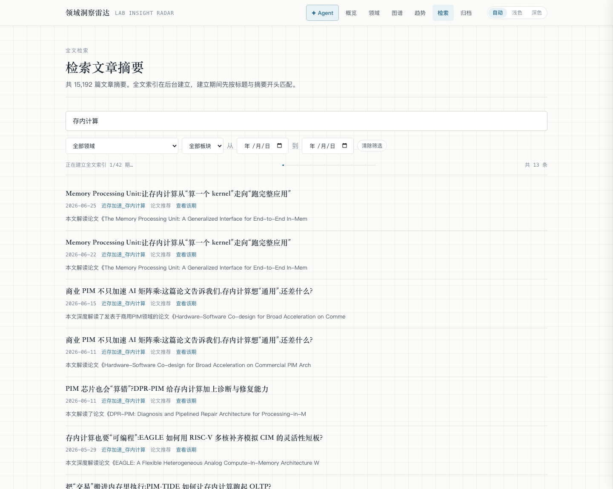
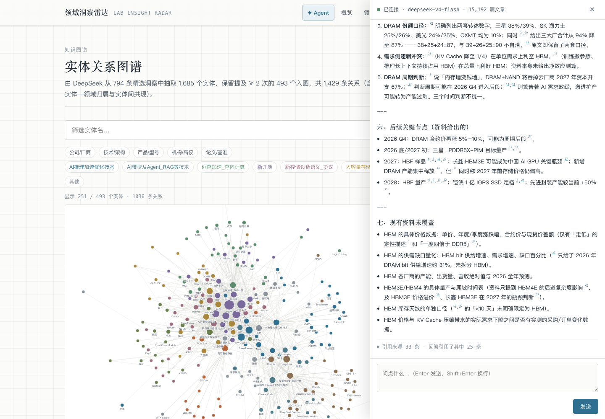
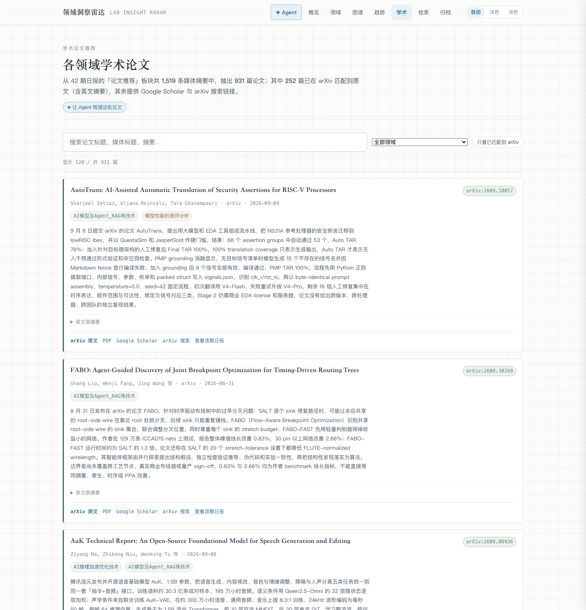
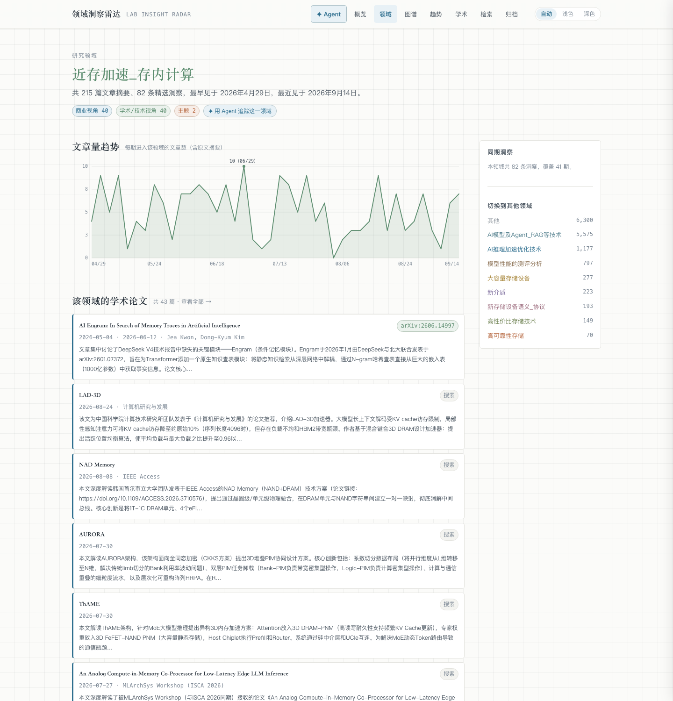

# Lab Insight Radar · 领域洞察雷达

把 OpenClaw 日报语料（存储 / AI 基础设施，43 期，2026-04-29 → 2026-09-17）变成**可浏览、可检索、可看趋势**的知识库，并发布到 GitHub Pages。

线上地址：https://bogedabuda.github.io/storage-ai-radar/

## 三条硬约束

1. **只读**：绝不修改 `Daily Report` 目录下任何内容 —— 构建前后对 26,680 个文件做 SHA-256 清单比对断言
2. **静态优先**：GitHub Pages 只托管派生数据（约 26 MB，gzip 后约 6 MB），353 MB 原始正文永不发布
3. **可降级**：Agent 仅本机运行；未启动时站点自动降级为纯检索模式，功能不受影响

## 快速开始

```bash
./rebuild.sh          # 快照校验 → 解析语料 → 再校验 → 构建前端
cd web && pnpm preview  # 本地预览 http://localhost:4173/storage-ai-radar/
```

## 分阶段交付

| 阶段 | 内容 | 状态 |
|---|---|---|
| **P1** | 解析层 + 数据契约 + 站点核心（概览/领域/检索/归档）+ 明暗三态主题 + GitHub Pages 部署 | ✅ 已完成 |
| **P2** | 实体抽取（DeepSeek + 增量缓存）+ 知识图谱 + 趋势跟踪 | ✅ 已完成 |
| **P3** | Agent 服务（FTS5 中文 RAG + 流式问答 + 引用）+ 站点侧栏 | ✅ 已完成 |
| **P4** | 文章去重 + 学术论文推荐（arXiv 解析 + Scholar/arXiv 链接） | ✅ 已完成 |

## P4：去重与学术论文推荐

### 一、去重

语料里同一篇文章会被多个公众号转发，导致同一期同一分类下出现 2~6 条同名记录。
解析阶段按「日期 + 分类 + 归一化标题」合并，**15,192 → 14,976 条**（合并 216 条，
涉及 205 条记录）；合并时保留首个条目的 id 以维持引用稳定，摘要取「非空且最长」
（实测 123 组同名但摘要不同）。

另有**跨领域多标签**（2,136 条）与**跨日期重复播报**（3,608 条）两类"看起来像重复"的记录：
它们携带的信息不同，**数据层保留**，但在**展示层**（检索结果、Agent 引用来源）
按「日期 + 归一化标题」归并成一条并合并领域标签，避免视觉重复。

### 二、学术论文推荐

`论文推荐` 板块里存的是中文科技媒体标题，真正的论文名嵌在摘要正文里。因此分三步：

| 步骤 | 做法 | 结果 |
|---|---|---|
| 1. 抽取 | 正则预抽 arXiv 编号 + 书名号英文标题，再由 DeepSeek 逐条判定并抽取论文名/会议/年份/作者 | 3,435 条 → 1,572 条判定为论文，1,524 条抽到标题 |
| 2. 解析 | arXiv API：有编号按 ID 直查，否则标题检索 + 相似度匹配 | 见 `papers.json` 的 `stats` |
| 3. 归并 | 同一篇论文多期被反复推荐（最多 6 次）→ 合并成一条，日期/领域取并集 | 817 篇唯一论文 |

**准确率防护**（都是实测踩出来的）：
- **领域闸门**：论文名 "ATLAS" 这类通用缩写曾命中**希格斯玻色子**论文，
  现在直接拒绝 `hep-*` / `astro-ph*` / `nucl-*` / `gr-qc` 领域的匹配
- **ID 与论文名冲突**：摘要里的 arXiv 编号可能指向同一段文字里提到的**另一篇**论文；
  只有抽取结果是"像完整标题"的长串时才用它质疑编号，短方法名（AFlex、AHE）
  不触发校验，避免误判
- **CJK 归一化**：归一化函数曾只保留 `[a-z0-9]`，导致所有中文论文标题塌缩成同一个缓存键，
  一篇的解析结果会被套用到全部中文论文上

每张论文卡片都给出 **中文摘要**（来自语料）+ **英文原摘要**（可折叠，来自 arXiv）+
**arXiv 原文 / PDF / Google Scholar / arXiv 搜索 / 查看该期日报** 链接；
未匹配到 arXiv 的也一定提供两个搜索链接兜底。

**独立页** `#/papers`（按领域/年份筛选、搜索、只看已匹配）+ **各领域页**的「该领域的学术论文」区块。

## P3：本机 Agent

零 npm 依赖（`node:http` + `node:sqlite` + `fetch`），默认只绑 `127.0.0.1:8787`。

```bash
python3 -m pipeline.build_index   # 建检索索引（~97 MB，5.5 秒，不进仓库）
cp agent/.env.example agent/.env  # 填 DeepSeek API key（不填也能用检索）
node agent/server.mjs             # 启动
```

站点右上角 **✦ Agent** 按钮会探测本机服务；探测不到时显示启动指引，**图谱/趋势/检索完全不受影响**
（已在 headless Chrome 中实测：Agent 停掉后图谱仍渲染 261 个节点）。

> ⚠️ **浏览器限制（实测）**：从 `https://bogedabuda.github.io` 这类**公网页面**请求本机
> `127.0.0.1` 会被浏览器的**本地网络访问（Local Network Access / Private Network Access）策略**拦截，
> 报 `Permission was denied for this request to access the 'loopback' address space`。
> 服务端已返回 `Access-Control-Allow-Private-Network: true`，但 Chrome 138+ 改为需要用户授权，
> 部分版本/策略下仍会直接拒绝。
>
> **因此要使用问答，推荐走本机预览**（与 Agent 同属 loopback 地址空间，不受该限制）：
>
> ```bash
> cd web && pnpm preview
> # 打开 http://localhost:4173/storage-ai-radar/  →  右上角 ✦ Agent
> ```
>
> 站点会检测自身是否来自 HTTPS 公网，并在这种情况下直接提示改用本机预览，而不是笼统报「未连接」。

| 能力 | 说明 |
|---|---|
| 中文全文检索 | FTS5 `trigram`；<3 字符的词自动退化为 LIKE 扫描 |
| 问句理解 | 剥离疑问词/停用词 + 识别「和/与/及/或」连接词 |
| 召回排序 | OR 召回 4 倍候选 → 按「命中几个检索词」重排（不会因某个词配不上而整体落空） |
| 流式问答 | SSE：`sources` → `delta`* → `done`，带 `[n]` 引用角标 |
| 原文深挖 | `articles/` 353 MB 不入库，按日期只读读取（避免再造一份 ~1.6 GB 索引） |
| 分享 | 问题可写进链接：`#/graph?ask=...` |

**实测效果**（问「存内计算和近存加速有什么区别？」）：34 条来源、引用 21 条，模型主动指出
「资料没有给出两者的正式定义」，并单列「资料内部的口径冲突」与「现有资料未覆盖」两节——
即不编造、不抹平矛盾。

## 测试

```bash
python3 -m unittest discover -s tests -t .   # 28 项：解析/契约/幂等/只读/图谱趋势/去重/论文
node --test agent/test.mjs                   # 8 项：检索词解析/上下文预算/端点/CORS
```

## 新增一期日报后

```bash
./rebuild.sh                                  # 解析 → 构建前端
python3 -m pipeline.extract_entities          # 图谱实体（增量）
python3 -m pipeline.extract_papers            # 论文身份（增量）
python3 -m pipeline.resolve_papers            # arXiv 解析（增量、限速）
python3 -m pipeline.build_index               # 刷新 Agent 检索索引
```

## P2：知识图谱与趋势（实测结果）

| 指标 | 数值 |
|---|---|
| 抽取实体 | 1,739 个（来自 814 条洞察，0 失败） |
| 入图实体 | 507 个（提及 ≥ 2 次） |
| 关系边 | 1,485 条 |
| 上升 / 新兴 / 退潮实体 | 43 / 21 / 1 |

**趋势指标定义**
- 动量 =（近 3 期均值 − 前 12 期基线）/ 基线；> +0.3 升温，< −0.3 降温
- 新兴实体 = 首次出现落在最近 3 期且提及 ≥ 2
- 退潮实体 = 基线 ≥ 3 次但最近 3 期 0 次

### P2 相对设计文档的三处修正（都是为了避免误导性结论）

1. **量化指标必须绑定主体**。原设计只按指标名归并，结果把不同主体的数值混成假趋势线
   （例如「模型参数量 4000→284 B」「毛利率 6.85→84.8%」）。现改为按 `(主体, 指标)` 成组出序列，
   并另外提供「指标名级观测清单」供查证具体数值。
2. **分类级「商业/学术」对比没有信息量**。日报模板对每个分类固定产出 1 条商业 + 1 条学术，
   所以各分类恒为 39/39、41/41。现改为**实体级视角倾向**（同一实体出现在哪种视角），
   这才有区分度：例如 `eSSD` 商业 10 / 学术 0（产业驱动），`H100` 商业 0 / 学术 6（实验室阶段）。
3. **去掉 `evolves`（演进）边**。该关系无法从语料可靠推导，强行生成会引入臆测，故不实现；
   实体与洞察的关联改为记录在节点 `digests` 字段上（避免 4,800+ 条低价值边）。

另：实体抽取结果存为**单个提交进仓库的 `pipeline/entities.json`**（而非 gitignore 的按哈希分片缓存），
这样图谱构建可离线复现，也让抽取结果可被 review。文本变化时按内容 SHA-256 自动重抽。


## 界面

| 概览 | 领域页 |
|---|---|
|  |  |

| 知识图谱 | 趋势跟踪 |
|---|---|
|  |  |

| 全文检索 | Agent 问答（本机） |
|---|---|
|  |  |

| 学术论文推荐 | 领域页的论文区块 |
|---|---|
|  |  |

> 截图取自线上站点（浅色主题）。Agent 面板取自本机预览，回答里单列了「现有资料未覆盖」一节。

## 语料规模（实测）

| 指标 | 数值 |
|---|---|
| 报告期数 | 43（2026-04-29 → 2026-09-17），随日报工作流持续增长 |
| 文章摘要 | 15,482 篇（去重前 15,700，合并 218 条真重复） |
| 精选洞察 | 814 条（含少量自由标题条目） |
| 详细要点 | 818 条（原文引用全覆盖） |
| 研究方向 | 10 个 |

> 语料会持续增长：本次会话期间日报工作流就自动新增了 2026-09-17 一期，
> 增量抽取只处理新增的 20 条洞察 / 142 条论文推荐（各约 25 秒），无需全量重跑。

### 两处真实数据稀疏（非解析缺陷）

- 12/42 期存在「分类为 0 篇」（分类文件只有标题行）；最稀疏的 `2026-05-15` 仅 22 篇、覆盖 5 个分类
- 32 篇文章的「总结」在源数据中即为空（多为招聘/汽车等非科技内容）

站点按**真实 0** 呈现，不做插值填补。

## 目录结构

```
pipeline/   只读解析语料（Python 标准库，零 pip 依赖）
  categories.py       分类 ↔ slug 映射
  parse_digest.py     output/*/daily_report.md  → 精选洞察
  parse_articles.py   total/*/*.md             → 文章摘要
  parse_detail.py     output/*/*_详细.md        → 原文来源链接
  extract_entities.py LLM 实体/指标抽取（增量、按内容哈希）
  analyze_trends.py   图谱与趋势的确定性计算
  aliases.json        实体别名归一表（可手工扩充）
  entities.json       抽取结果（提交进仓库，可离线复现）
  extract_papers.py   从论文推荐板块抽取论文身份（LLM + 增量缓存）
  resolve_papers.py   用 arXiv API 解析论文（限速 1 请求/3 秒、可续跑）
  build_papers.py     汇总为 web/public/data/papers.json
  papers.json         论文抽取结果（提交进仓库）
  papers_cache.json   arXiv 解析结果（提交进仓库）
  build_index.py      构建 insight.sqlite 检索索引（Agent 用）
  build.py            编排入口：python3 -m pipeline.build
  readonly_guard.py   只读保证：快照 / 校验
  paths.py            路径与写入门禁（拒绝写入数据源）
web/        Vite + TypeScript 静态站（唯一运行时依赖 d3-force，图表自绘 SVG）
  public/data/        派生数据（随仓库提交，CI 直接用）
  src/search/         全文检索 Web Worker（中文子串匹配 + AND 语义）
agent/      Node 零依赖 Agent 服务（P3）
  server.mjs          HTTP + SSE 服务与路由
  rag.mjs             检索、问句切词、上下文组装
  llm.mjs             DeepSeek 流式客户端与 key 解析
  test.mjs            8 项测试（node --test）
  .env.example        配置样例（agent/.env 已 gitignore）
tests/      unittest（17 项：契约/边界/幂等/只读）
```

## 常用命令

```bash
python3 -m pipeline.build              # 重新生成派生数据
python3 -m pipeline.readonly_guard verify   # 校验语料未被改动
python3 -m unittest discover -s tests -t .  # 跑测试
cd web && pnpm run build               # 前端构建
```

## 数据源

`/Users/boding/.openclaw/workspace/Daily Report`（可用 `DAILY_REPORT_DIR` 环境变量覆盖）

## 配置

前端子路径固定在 `web/vite.config.ts` 的 `base: '/storage-ai-radar/'`，与仓库名一致；改名时两处都要改。

## 文档

- 设计文档：[`docs/superpowers/specs/2026-09-16-lab-insight-radar-design.md`](docs/superpowers/specs/2026-09-16-lab-insight-radar-design.md)
